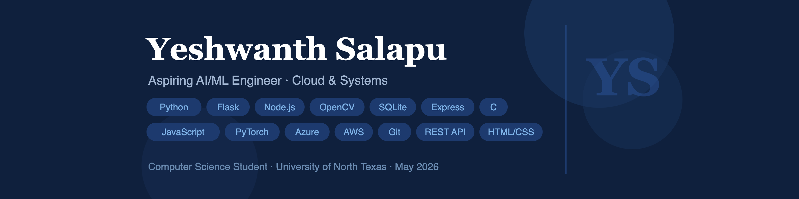

 

<h1 align="center">Hi there, I'm Yeshwanth Salapu 👋</h1>

  <em>Student • Cloud computing & AI Enthusiast • Problem Solver</em>

  
  
  

---

### 🚀 About Me
- 🎓 I'm **Yeshwanth Salapu**, a student based in **Denton, Texas**, passionate about **cloud computing** and **AI/ML**.
- 🧩 I enjoy turning ideas into working prototypes—especially tools that automate workflows or make learning easier.
- 🤝 Open to entry level positions, and interesting side projects in:
  - Cloud apps & APIs
  - AI-assisted tools
  - Security and DevOps basics

---

### 🧪 Projects

| Project | What it does | Tech |
|---|---|---|
| [Portfolio Website](https://ysalapu24.github.io/prtfolio-website/) | Personal site & project hub | HTML, CSS, JavaScript |
| [Video Segmentation System](https://github.com/Ysalapu24/video-segmentation) | Detects scene transitions & splits videos into clips | Python, OpenCV, NumPy |
| [Smart Inventory Demo](https://github.com/Ysalapu24/smart-inventory-demo) | Low-stock alerts, CRUD API & analytics dashboard | Python, Flask, SQLite |
| [Mini Cloud Monitor](https://github.com/Ysalapu24/Mini-Cloud-Monitor) | Pings endpoints, measures latency & live status dashboard | Node.js, Express |
| [UDP Ping Client-Server](https://github.com/Ysalapu24/udp-ping) | Simulates packet loss & measures RTT over UDP | C, Sockets |
| [Lego Brick Counter](https://github.com/Capstone-4901-Team-NextGen-Solutions/Lego-Brick-Counter) | CV-based brick identifier & set suggester | Python, Flask, OpenCV, Flutter |

> Tip: Pin 3–6 repos on your GitHub Profile → Customize your pins for a clean front page.

---

### 🧰 Tech Stack

  
  
  
  
  
  
  
  
  
  
  
  

---

### 📚 Currently Learning
- Moving from **Node.js → FastAPI**
- **Containerization & CI/CD** (Docker, GitHub Actions)
- **Databases** (MongoDB + VS Code)
- **Cloud basics** (Microsoft Azure, AWS)

---

### 📈 GitHub Stats

  
  

---

### 💬 Let's Connect
- 📫 Reach me: **yeshsalapu2@gmail.com**
- 💼 LinkedIn: **https://www.linkedin.com/in/yeshwanth-salapu-a257b7291/**
- 🌐 Portfolio: **https://ysalapu24.github.io/prtfolio-website/**

---

  Built with skills. Always learning.

