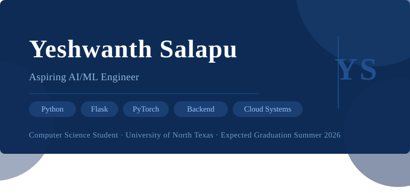

 

 

<h1 align="center">Hi there, I'm Yeshwanth Salapu 👋</h1>

  <em>Student • Cloud computing & AI Enthusiast • Problem Solver</em>

  <!-- Social badges (replace the links) -->
  
  
  

---

### 🚀 About Me
- 🎓 I’m **Yeshwanth Salapu**, a student based in **Houston, Texas**, passionate about **cloud computing** and **AI/ML**.
- 🧩 I enjoy turning ideas into working prototypes—especially tools that automate workflows or make learning easier.
- 🤝 Open to entry level positions, and interesting side projects in:
  - Cloud apps & APIs
  - AI-assisted tools
  - Security and DevOps basics

---

### 🧪 Projects
<!-- Replace rows with your real repos. Keep the concise “what it is” + tech stack style. -->
| Project | What it does | Tech |
|---|---|---|
| [Portfolio Website](https://YOUR_PORTFOLIO_URL) | Personal site & project hub | HTML, CSS, (optional: React) |
| [Smart Inventory Demo](https://github.com/YOUR_USERNAME/smart-inventory-demo) | Low-stock alerts & basic analytics | Python, SQLite, Flask |
| [Mini Cloud Monitor](https://github.com/YOUR_USERNAME/cloud-monitor) | Checks uptime & pings endpoints | Node.js, Express |

> Tip: Pin 3–6 repos on your GitHub Profile → Customize your pins for a clean front page.

---

### 🧰 Tech Stack
<!-- Add or remove to match your skills -->

  
  
  
  
  
  
  
  

---

### 📚 Currently Learning
- Moving from **Node.js → FastAPI**
- **Containerization & CI/CD** (streamlit, GitHub Actions)
- **Databases** (Mongo DB + VS Code)
- **Cloud basics** (Microsoft Azure, AWS)

---

### 📈 GitHub Stats
<!-- Replace YOUR_USERNAME with your actual GitHub username -->

  
  

<!-- Optional: Top Languages card (be mindful—it reflects public repos only) -->
<!--  -->

---

### 💬 Let’s Connect
- 📫 Reach me: **yeshsalapu2@gmail.com**
- 💼 LinkedIn: **https://www.linkedin.com/in/yeshwanth-salapu-a257b7291/**
- 🌐 Portfolio: **YOUR_PORTFOLIO_URL**

---

<!-- Small signature -->

  Built with skills. Always learning.

