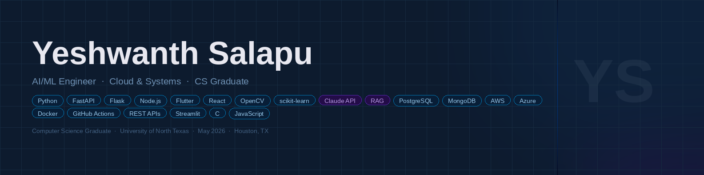

  

<h1 align="center">Hi there, I'm Yeshwanth Salapu 👋</h1>

  <em>CS Graduate · Cloud Engineering · AI/ML</em>

  
  
  

---

### 🚀 About Me

- 🎓 B.S. in Computer Science · **University of North Texas** (May 2026)
- 📍 Based in **Houston, Texas**
- ☁️ Passionate about **cloud engineering**, **AI/ML**, and building tools that solve real problems
- 🔍 Actively seeking roles in **Cloud Engineering**, **AI Engineering**, or **Software Engineering**
- 🤝 Open to collaborating on cloud-native apps, AI tools, and backend systems

---

### 🧪 Projects

| # | Project | What it does | Tech |
|---|---------|--------------|------|
| 01 | [JARVIS](https://github.com/Ysalapu24/Jarvis) | Iron Man-inspired AI voice assistant — wake word, ElevenLabs TTS, Gmail/Calendar/Drive/WhatsApp integrations, Flutter app & Siri shortcuts | Python, Flutter, FastAPI, ElevenLabs, Google APIs |
| 02 | [HalluGuard for Retail](https://github.com/Ysalapu24/halluguard-extension) | Hallucination detection layer for retail AI — validates AI-generated product info against a RAG knowledge base | Python, FastAPI, Claude API, RAG |
| 03 | [Community Engagement Dashboard](https://github.com/Ysalapu24/CommunityEngagementDashboard) | Real-time Discord & Slack sentiment analysis dashboard with engagement trend tracking | Python, Streamlit, Discord API, Slack API, NLP |
| 04 | [Food Safety Recall Middleware](https://github.com/Ysalapu24/food-safety-middleware) | Multi-agent AI pipeline monitoring FDA recall data and routing alerts to stakeholders | Dialogflow CX, Flowise, Node.js, REST API |
| 05 | [Glass Classification System](https://github.com/Ysalapu24/glass-classification) | ML-powered forensic glass type classifier with React frontend and Flask API | Python, scikit-learn, Flask, React |
| 06 | [Office Workplace Database](https://github.com/Ysalapu24/office-workplace-db) | Relational DB system for office operations — normalized schema, complex queries, stored procedures | PostgreSQL, SQL |
| 07 | [Lego Brick Counter](https://github.com/Capstone-4901-Team-NextGen-Solutions/Lego-Brick-Counter) | CV-based brick identifier, inventory matcher & set suggester — UNT Capstone | Python, Flask, OpenCV, Flutter, Azure CV, SQLite |
| 08 | [Video Segmentation System](https://github.com/Ysalapu24/video-segmentation) | Detects scene transitions & exports each clip using histogram analysis | Python, OpenCV, NumPy, Matplotlib |
| 09 | [Smart Inventory Demo](https://github.com/Ysalapu24/smart-inventory-demo) | Low-stock alerts, CRUD API & analytics dashboard | Python, Flask, SQLite, REST API |
| 10 | [Mini Cloud Monitor](https://github.com/Ysalapu24/Mini-Cloud-Monitor) | Pings endpoints, measures latency & serves a live status dashboard | Node.js, Express.js, JavaScript |
| 11 | [UDP Ping Client-Server](https://github.com/Ysalapu24/udp-ping) | Simulates packet loss & measures RTT over UDP | C, UDP Sockets, Networking |

---

### 🧰 Tech Stack

**Languages**

**Frameworks & Tools**

**Cloud & DevOps**

**Databases**

**AI & ML**

---

### 📜 Certifications

- ☁️ **Microsoft Azure Fundamentals — AZ-900** · Microsoft
- ☁️ **AWS Cloud Practitioner — CLF-C02** · Amazon Web Services
- 🔐 **Certified in Cybersecurity — CC** · ISC²

---

### 📚 Currently Learning

- **Cloud Engineering** — AWS & Azure architecture, cloud-native design patterns
- **AI Engineering** — RAG pipelines, LLM integration, prompt engineering
- **DevOps** — containerization with Docker, CI/CD with GitHub Actions

---

### 📈 GitHub Stats

  
  

---

### 💬 Let's Connect

- 📫 **yeshsalapu2@gmail.com**
- 💼 [LinkedIn](https://www.linkedin.com/in/yeshwanth-salapu-a257b7291/)
- 🌐 [Portfolio](https://ysalapu24.github.io/prtfolio-website/)

---

  Built with skills. Always learning.

